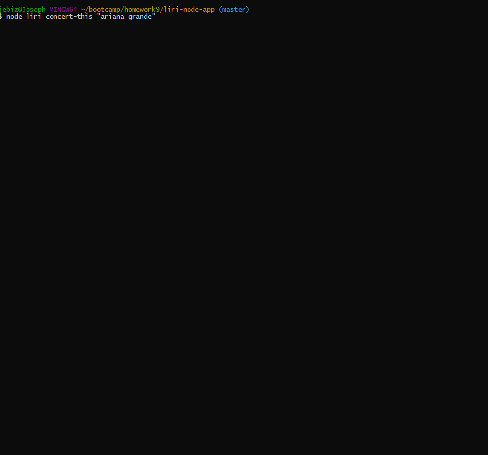

# liri-node-app

CLI based app that takes in commands and displays info.

Commands:
concert-this
spotify-this-song
movie-this
do-what-it-says

Dependencies required are node-spotify-api, moment, and request.
Additionally spotify api key must be in .env file.

